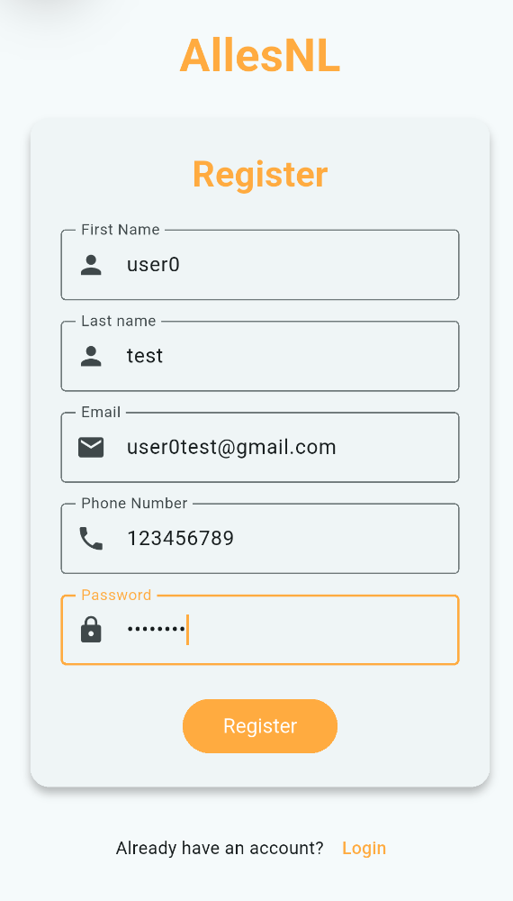
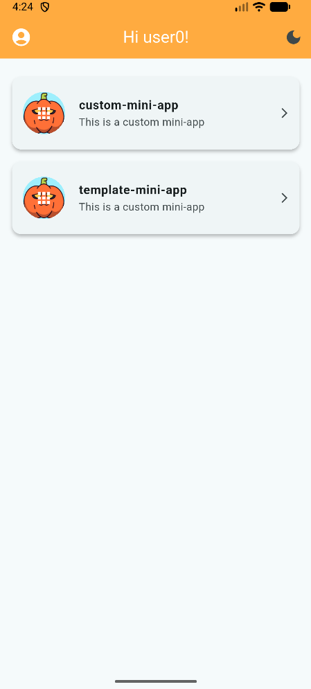
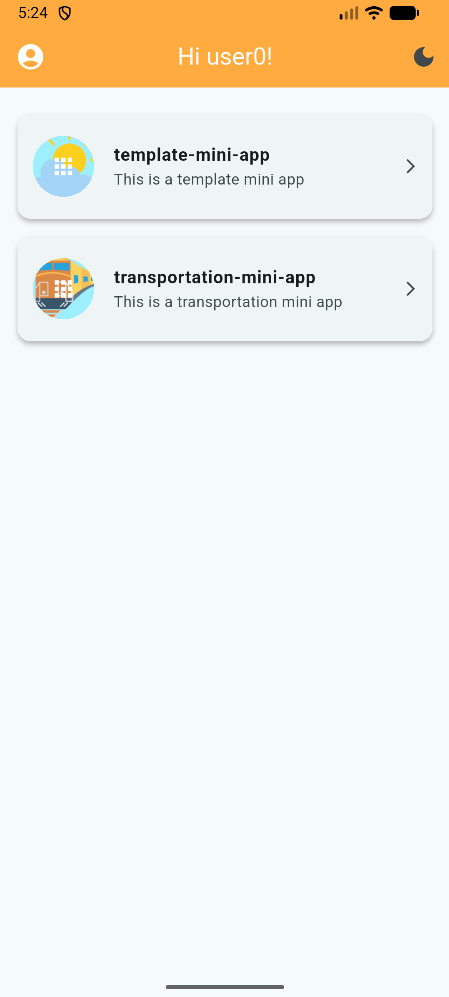
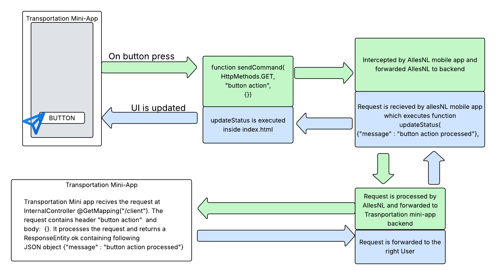
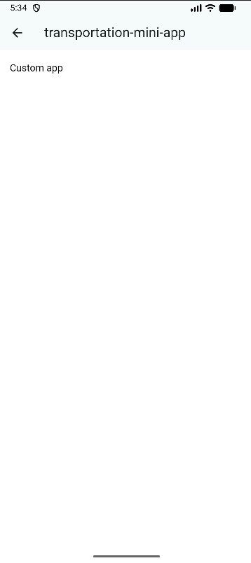
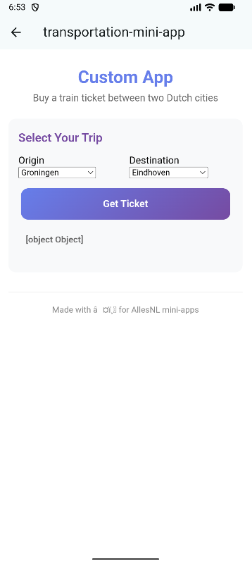
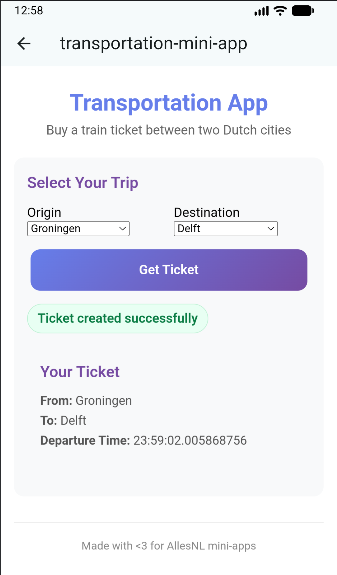

# AllesNL

**AllesNL** is a super app designed to make visiting the Netherlands convenient.  
No need to worry about whether your favorite delivery app works in the Netherlands or how to navigate public transport, AllesNL allows you to quickly discover and use **mini-app** versions of the most popular Dutch applications.  
Download AllesNL, register, and you’ll be ready to enjoy the complete Dutch app ecosystem.

To get familiar with the concept of super-apps and mini-apps the following blog gives good overview: https://web.dev/explore/mini-apps .

---

This repository is part of the TU Delft *Software Architecture* course project. We want new mini-apps to be easily integrated into AllesNL by external developers.  
We’d like your feedback on how well we explain AllesNL and how demanding you find/estimate the mini-app development process to be, in order to assess ease of integration for our final product.  
Please answer the following questionnaire while going through the tutorial: [Feedback Form](https://docs.google.com/forms/d/e/1FAIpQLSe0hIYqRhT8uqYeOjy-PNBq0vHsq9Jq22h05tQBd0PFt6baXw/viewform?usp=header).  
If you actually develop a mini-app, please send it to **Aykut, Bryan, Halil, or Luka** so we can add it to our demo.

---

## Mini-App Development Tutorial

### Prerequisites
AllesNL is still under development, so an IDE for developing AllesNL mini-apps does not exist yet.  
Therefore, we’ll use this Proof of Concept (PoC) code to develop and test new mini-apps.

To run the code, the following prerequisites are required:
* Docker  
* Android Studio with IntelliJ (setup: [Android Studio Setup Guide](https://docs.flutter.dev/tools/android-studio))  
  or Android Studio without IntelliJ (setup: [Android Setup Guide](https://docs.flutter.dev/platform-integration/android/setup))

---

### Getting to Know the Repository

This section explains the structure of the repository.

#### AllesNL
This is the main PoC AllesNL application. It consists of four folders — but three are important to us:

* **`allesnl_mobile`** – contains the mobile application code  
* **`backend`** – contains the backend core  
* **`mini-apps`** – contains all mini-apps  

While we need `allesnl_mobile` and `backend` to test our mini-app, we won’t modify any code there.  
In the `mini-apps` folder, you’ll find two subfolders: **`template`** and **`custom`**.  
The `template` folder contains an example of a quotes mini-app.  
We’ll develop our own mini-app in the **`custom`** folder.

#### Custom
This folder is a copy of `AllesNL/mini-apps/custom`.  
Ideally, developers would receive only a boilerplate mini-app to develop using a dedicated IDE.  
Since this IDE doesn’t exist yet, the `custom` folder showcases what code would be required in the final version.

The `custom` folder contains a **Spring Boot** application, including Docker, Maven, and Git configuration files, as well as the `src` directory with the Java code.  
Inside `src`, we have two main parts — **`java`** and **`resources`**, both of which are important.

* In **`resources`**, you’ll find:
  * `index.html` – served when your mini-app is opened  
  * a `.properties` file defining your mini-app’s name, icon, and description  

* In **`java`**, you’ll find your backend logic.  
  Navigate to `/custom/src/main/java/nl/allesnl/custom`.  
  Here, you can see various elements that make up the mini-app backend.  

  The following folders can be modified by mini-app developers:
  * `configuration`  
  * `controller`  
  * `record`  
  * `service`  

Each folder can be extended.  
**Note:** You may modify the methods in `controller/InternalController.java`, but do **not** change their signatures — AllesNL Core relies on them to locate your mini-app correctly.

---

### Developing a Mini-App

#### Step 0: Setup

In this step, we’ll set up AllesNL.

1. Clone the repository if you haven’t already.  
2. Open AllesNL in your favorite IDE.  
3. Start Docker.  
4. Navigate to `AllesNL/backend` and run:  
   ```bash
   docker compose up --build -d
   ```
 Wait for docker to finish building.

5. Navigate to `AllesNL/mini-apps` and run:  
    ```bash
    docker compose up --build -d
    ```
 Wait for docker to finish building. It is important to build mini-apps after the backend so they can execute registration function.

6. Open `AllesNL/allesnl_mobile` in Intellij with android studio plugin or in android studio.

7. Start an android phone emulator.

8. Select the virtual phone as your desired platform and run the application.

9. At this point you should be able to see AllesNL mobile application. For the purpose of development we are going to create an user. Please click highlighted register word. Once, register screen opens fill in the fields with any information and press the register button. 



10. Login with the created users email and password. After login in you should see custom and template mini-app.




#### Setting Up Mini-App Details

The first step is to come up with your app idea and name.  
Since AllesNL is designed to provide lightweight versions of existing apps, you likely already have an idea in mind.

For the purpose of this tutorial, we’ll develop a **mini-app for buying train tickets between two destinations**.

To set up your app name, description, and icon, navigate to:  
`AllesNL/mini-apps/custom/src/main/resources/application.properties`

Modify the `name` and `description` fields as desired, but please keep the following format.  
For icons, use any valid `.png` URL — for example, you can find free icons at [Flaticon](https://www.flaticon.com/).
```properties
spring.application.name=custom-mini-app
app.description=This is a custom mini-app
app.logo-url=https://cdn-icons-png.flaticon.com/128/17734/17734788.png

```

```properties
spring.application.name=transportation-mini-app
app.description=This is a transportation mini app
app.logo-url=https://cdn-icons-png.flaticon.com/128/713/713309.png

```

Next, update the service and container names in so they mach the name in `AllesNL/mini-apps/custom/src/main/resources/application.properties`:  
`AllesNL/mini-apps/custom/docker-compose.yml`

**Example:**
```yaml
services:
  transportation-mini-app:
    container_name: transportation-mini-app
    build: .
    networks:
      - mini-apps
```
The home screen should now look like:



#### Designing the UI

The screen displayed to AllesNL users once they open your mini-app is located at:  
`AllesNL/mini-apps/template/src/main/resources/static/index.html`

Please navigate to this file.  
Although it currently contains only a few HTML elements, we can identify several important parts:

1. **`<style></style>` element**  
   This defines the common AllesNL style so that all mini-apps share the same look and feel.  
   ⚠️ **Do not modify this section.**

2. **`function updateStatus(body, isError)`**  
   This function is used to update the user interface on the client’s device.
    - `body` is the JSON object returned by your mini-app backend.
    - `isError` indicates whether the action that triggered the update was successful or resulted in an error.  
      ✅ You can **change the body of this function** to customize your app’s behavior,  
      but **do not change the function signature**.

3. **`function sendCommand(method, dataType, body, sendUserData = false)`**  
   This function is the core of AllesNL’s logic.  
   It takes four parameters: method which is of type
   ```javascript
   const HttpMethods = Object.freeze({
       POST: 'POST',
       GET: 'GET',
       DELETE: 'DELETE'
   });
    ```
, dataType, which is a header being passes to your mini-app backend, body which is the actual data being sent, and 
user flag which indicates should user information be sent under `body["user"]` .
⚠️ **This function should NOT be changed.**


4. **`function makePayment(amount)`**  
   This function is a **special case** of the `sendCommand` function.  
   It initializes a **payment procedure** for the specified `amount` between the current user and your mini-app.  
   ⚠️ **This function should NOT be changed.**

---

##### What Is This Workflow?

Your `index.html` file runs on the client’s phone.  
However, AllesNL cannot allow user information or internal utilities to be directly shared.  
Therefore, AllesNL **intercepts all JavaScript functions** that attempt to reach outside the embedded browser.

To communicate with the AllesNL backend, mini-apps must follow the described format.

The communication flow is illustrated in the following diagram:



---

##### Updating the UI

Currently there is not manny elements in our mini-app:



To design the UI I like to start by asking my favourite LLM to create an .html file given certain requirements.
I am going to be using ChatGPT 5 by passing the current index.html and writing the following promt:
```text
Can u make UI with 2 fields which are dropped down menu to select destinations. Destinations should be cities in netherlands.
 There should be a button called get ticket which calls sendComand(httpsMethod.Post, "ticket", {"origin":city1, "destination": city2}
 existing style and javascript should not be changed
```

Following is the result:



To see the results after editing index.html there is two options:
1. Redeploy mini-apps: navigate to `AllesNL/mini-apps` and run:
    ```bash
    docker compose up --build -d 
   ```
   Then exit the mini-app window to get the list of mini-apps again. Press on transportation mini-app.
2. This is a hack for developing UI only. Navigate to `AllesNL/allesnl_mobile/lib/views/widgets/mini_app_card.dart` 
   and replace 

```java
      // --- DEVELOPMENT OVERRIDE: Uncomment the line below to load local dummy HTML ---
      //final String htmlContent = await rootBundle.loadString('assets/html/index.html');


      // --- PRODUCTION CODE ---
      //final user = User(id: 0, firstName: userName, lastName: userName, email: userEmail, phoneNumber: userPhoneNumber);
      //final String? htmlContent = await ApiService.getMiniAppByIdUser(miniApp.registrationId , user);
      final String? htmlContent = await ApiService.getMiniAppById(miniApp.registrationId);
```

with 

```java

        // --- DEVELOPMENT OVERRIDE: Uncomment the line below to load local dummy HTML ---
      final String htmlContent = await rootBundle.loadString('assets/html/index.html');


      // --- PRODUCTION CODE ---
      //final user = User(id: 0, firstName: userName, lastName: userName, email: userEmail, phoneNumber: userPhoneNumber);
      //final String? htmlContent = await ApiService.getMiniAppByIdUser(miniApp.registrationId , user);
      //final String? htmlContent = await ApiService.getMiniAppById(miniApp.registrationId);
```

Now you can use android studio to fastly reload your html changes. Copy your `AllesNL/mini-apps/template/src/main/resources/static/index.html`
into `AllesNL/allesnl_mobile/assets/html/dummy_content.html`.

--- 

### Updating the backend
Please navigate to `custom/src/main/java/nl/allesnl/custom/controller/InternalController.java` and locate the `@GetMapping("/client")` method.  
Here, we will process the incoming request and return a JSON object that can be handled by the `updateStatus` function on the frontend.

We will return a `Map` object indicating whether the action was successful, along with any relevant ticket data.  
If the received object is not recognized, the function will return a message indicating failure and the corresponding error.

At the end, your function should look like this:
```java
    @PostMapping("/client")
    public ResponseEntity<Map<String, Object>> postClientData(
            @RequestBody Map<String, Object> payload,
            @RequestHeader HttpHeaders headers) {

        Map<String, Object> res = new HashMap<>();
        String dataTypeHeader = headers.getFirst("Data-Type");

        switch (dataTypeHeader) {
            case "ticket": {
                Map<String, Object> ticketData = new HashMap<>();
                ticketData.put("time", LocalTime.now().toString());
                ticketData.put("origin", payload.get("origin"));
                ticketData.put("destination", payload.get("destination"));

                res.put("success", true);
                res.put("message", "Ticket created successfully");
                res.put("data", ticketData);
                break;
            }

            default:
                res.put("success", false);
                res.put("message", "Unknown Data-Type header: " + dataTypeHeader);
                break;
        }

        return ResponseEntity.ok(res);
    }
```
Next step is to update 'updateStatus' function to process the returning map. If the action is successful we will create new card element in our page.
```javascript
   function updateStatus(body, isError) {
    const el = document.getElementById('response-status');
    el.classList.remove('status-true', 'status-false', 'muted');

    // Normalize body into an object if it's a string
    let obj = body;
    if (typeof body === 'string') {
        try { obj = JSON.parse(body); } catch (_) { obj = body; }
    }

    // Clear any existing ticket cards
    const oldCard = document.getElementById('ticket-card');
    if (oldCard) oldCard.remove();

    if (obj && typeof obj === 'object') {
        // Handle backend JSON structure
        const success = obj.success === true;
        const message = obj.message || 'Response received';
        el.textContent = message;
        el.classList.add(success ? 'status-true' : 'status-false');

        // If we got a successful ticket creation, show the ticket card
        if (success && obj.data && obj.data.origin && obj.data.destination && obj.data.time) {
            const ticket = obj.data;

            // Create a card container
            const card = document.createElement('div');
            card.id = 'ticket-card';
            card.className = 'card';
            card.style.marginTop = '16px';
            card.innerHTML = `
                <h3> Your Ticket</h3>
                <p><strong>From:</strong> ${ticket.origin}</p>
                <p><strong>To:</strong> ${ticket.destination}</p>
                <p><strong>Departure Time:</strong> ${ticket.time}</p>
            `;

            // Insert it below the response-status element
            el.insertAdjacentElement('afterend', card);
        }
        return;
    }

    // Fallback for plain text
    el.textContent = String(body);
    el.classList.add(isError ? 'status-false' : 'muted');
}
```
Now after clicking get ticket button, our application should displayed received ticket. Our final application looks like following:



Current form/code of our mini-app can be found in `custom` folder. 

---

### Integrate with Allesnl

Currently, there is no systematic way to add new mini-apps to AllesNL. However, even in the final product mini-app addition will be regulated by AllesNL team.
To integrate your mini-app please send zipped custom folder to Aykut, Bryan, Halil, or Luka.

---

### Final Notes

This tutorial covers the basic logic of AllesNL. For example of how external services are integrated, please refer to the Template Mini-App: `AllesNL/mini-apps/template`.
Adding additional functionality to your mini-apps largely corresponds to developing a standard web application with Spring backend and in that sense, the team hopes that AllesNL does not introduce much additional complexity.
In the future, we aim to integrate a smoother and more robust workflow between the mobile app and the mini-app backend, as well as provide support for modern web applications and provide detailed documentation of core AllesNL functions.


